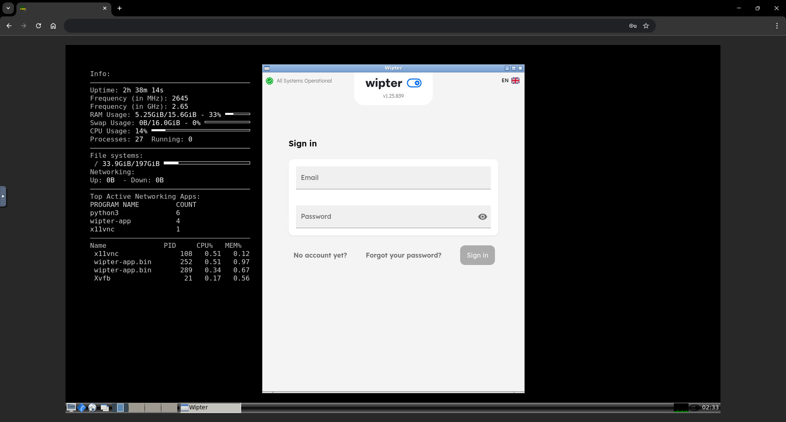

# Docker-Wipter
 
## Overview
This repository provides a Dockerized solution for running Wipter. The setup uses `ghcr.io/techroy23/docker-slimvnc:latest` as base image to ensure minimal system overhead and integrates all necessary dependencies for seamless operation.

## Features
- Lightweight Debian-based image (`ghcr.io/techroy23/docker-slimvnc:latest`).
- Automated installation of required dependencies.
- Automated Wipter login via  `WIPTER_EMAIL` `WIPTER_PASSWORD`.
- VNC password can be set via `VNC_PASS`.

## Run
```

docker run -d --name docker-wipter \
  -e WIPTER_EMAIL="YourEmail@here.com" \
  -e WIPTER_PASSWORD="your_secure_password" \
  -e DISCORD_WEBHOOK_INTERVAL=300 \
  -e DISCORD_WEBHOOK_URL="your_dicord_webhook_url" \
  -e VNC_PASS="your_secure_password" \
  -e VNC_PORT=5555 \
  -e NOVNC_PORT=6666 \
  -p 5555:5555 -p 6666:6666 \
  --shm-size=2gb \
  ghcr.io/techroy23/docker-wipter:latest

```

## Access
- VNC Client: localhost:5555
- Web Interface (noVNC): http://localhost:6666

## Promo
<ul><li><a href="https://wipter.com/register?via=66075F1E60"> [ REGISTER HERE ] </a></li></ul>
<div align="center">
  <a href="https://wipter.com/register?via=66075F1E60">
    
  </a>
</div>

## Screenshot
<div align="center">
  
</div>

